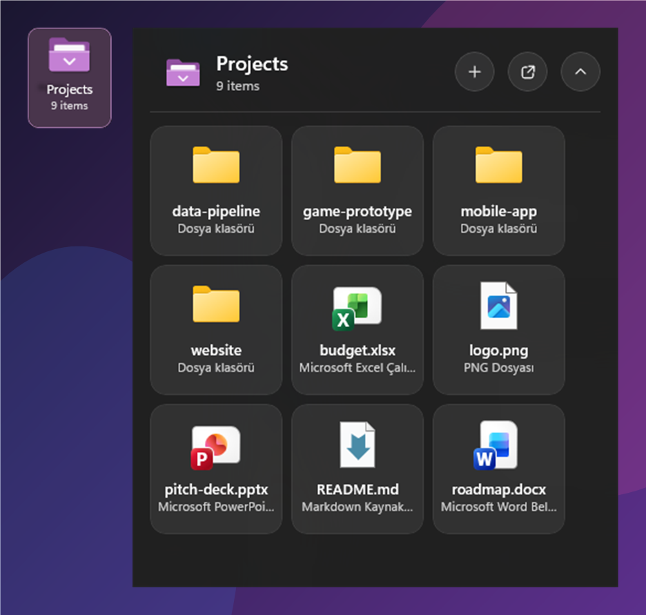
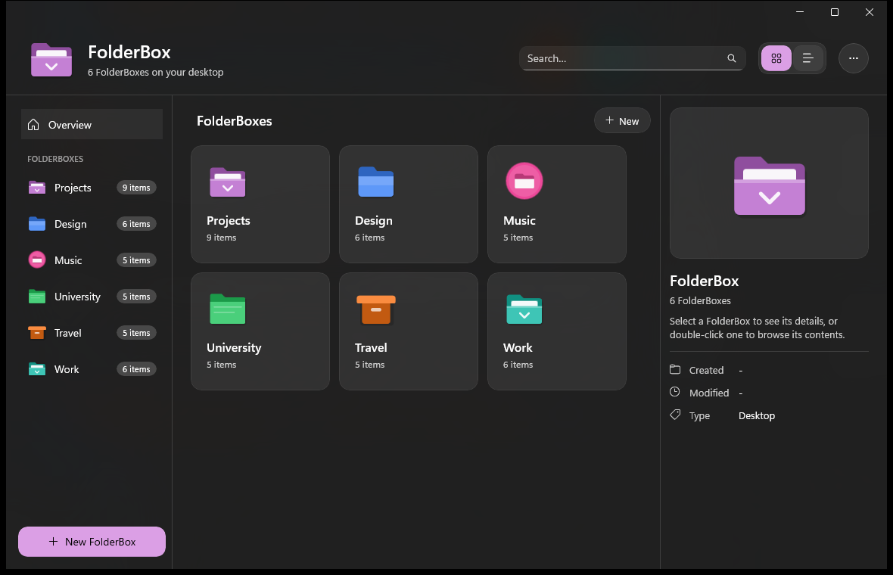
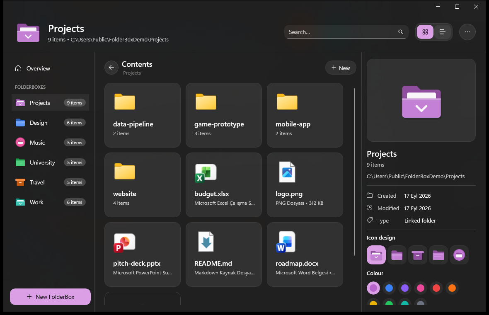
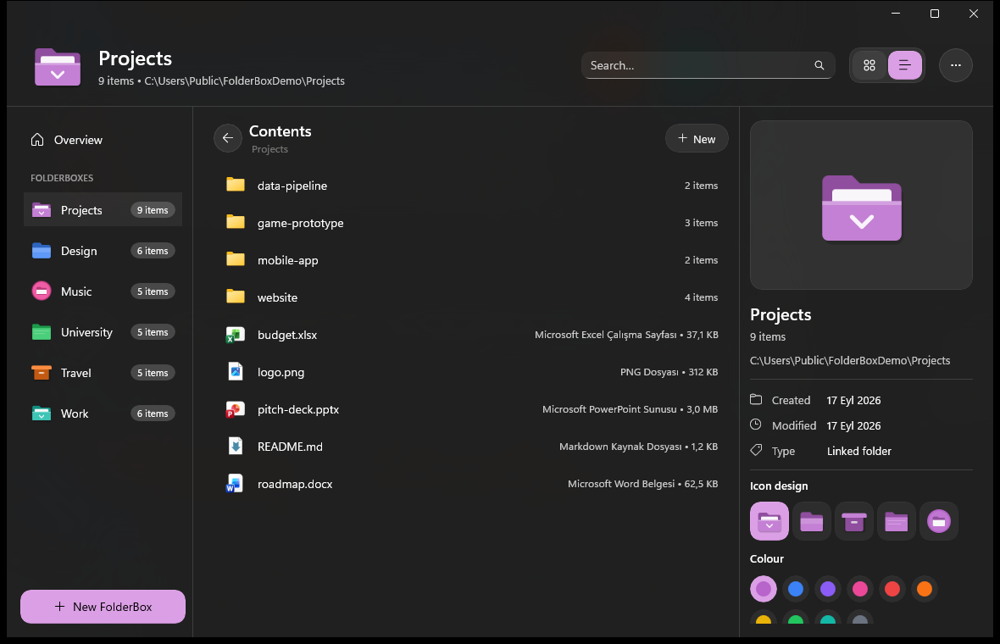
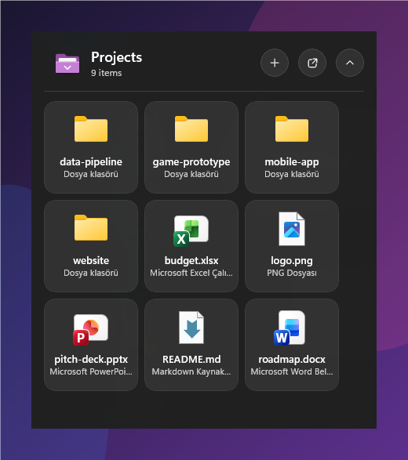
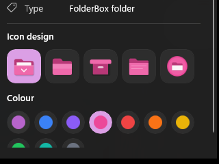
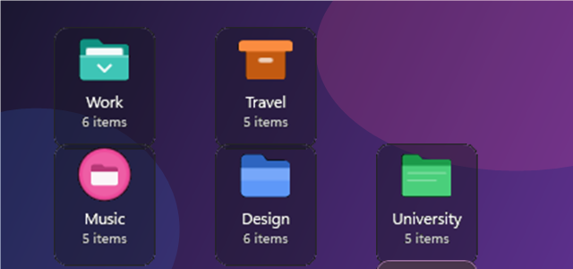

<div align="center">


# FolderBox

**Real Windows folders on your desktop that expand with a single click.**

[](#requirements)
[](#building-from-source)
[](#architecture)
[](LICENSE)
[](../../releases/latest)

</div>

---

FolderBox turns any folder into a tile that sits on your desktop like a normal icon. Click it and the
folder opens in a glass panel right next to the tile — no Explorer window, no clutter. Click again
(or press `Esc`, or click anywhere else) and it collapses. Double-click still opens Explorer, exactly like
a normal icon.

It is **not** a file manager, a dashboard or a widget platform. It does one thing: real folders, placed
anywhere on the desktop, expandable with one click.

<div align="center">

</div>

## What it does

1. **Create a FolderBox** — right-click the desktop → **New → FolderBox**, or use the admin panel. An
   empty real folder is created and a tile appears next to your mouse, already in rename mode.
2. **Fill it** — drag files or folders from the desktop / Explorer onto the tile or into the open panel,
   or use the panel's **+** button (add files, add a folder, new sub-folder).
3. **Use it** — one click expands the panel: real Shell icons, sub-folder navigation with breadcrumbs,
   open with the default app, `F2` rename, `Delete` → Recycle Bin, the real Windows context menu.
4. **Manage it** — the admin panel shows every FolderBox, lets you browse their contents, pick an icon
   design and colour, rename, lock, hide, or remove them.

Nothing is copied, moved or indexed behind your back. The file system is always the source of truth;
FolderBox only *shows* it.

## Features

<table>
<tr>
<td width="50%" valign="top">

**Desktop tiles**
- Sit on the desktop layer: above the wallpaper and desktop icons, below every application window
- Snap to Windows' own desktop icon grid and never overlap desktop icons or each other
- Drag to move, lock in place, per-monitor and per-DPI aware
- Not in the taskbar, not in Alt+Tab, survive `explorer.exe` restarts

**Expanded panel**
- Acrylic glass panel that opens right/left/below/above depending on free space, never off-screen
- Cards with real Shell icons, localized type names and sizes
- Sub-folder navigation with breadcrumb and Back
- Live refresh through `FileSystemWatcher` (create/rename/delete outside FolderBox shows up instantly)
- Keyboard: `Enter` open, `F2` rename, `Delete` to Recycle Bin, `Backspace` back, `Esc` close

</td>
<td width="50%" valign="top">

**Files stay safe**
- Every file operation goes through Windows' own `IFileOperation`: native conflict dialogs
  (Replace / Skip / Keep both), Recycle Bin, undo
- Removing a FolderBox never deletes anything — you are asked whether to move its contents back to
  the desktop or keep the folder

**Integration**
- Right-click the desktop → **New → FolderBox**
- Desktop launcher shortcut, tray icon, starts with Windows (all per-user, no admin rights)
- The `FolderBox` folder is pinned to Quick access, so every Open / Save dialog (VS Code, Visual
  Studio, Office, …) reaches your FolderBoxes from the sidebar
- Follows the Windows light/dark theme and accent colour

**Admin panel**
- Overview of all FolderBoxes, browse into any folder, grid or list view, search
- Icon designs: 5 vector designs × 10 colours per FolderBox

</td>
</tr>
</table>

## Screenshots

<div align="center">

**Admin panel — overview of every FolderBox**



**Browsing inside a FolderBox, with the details pane and icon picker**



**List view**



**The expanded desktop panel** &nbsp;&nbsp;&nbsp;&nbsp;&nbsp;&nbsp;&nbsp; **Icon designs and colours**

 &nbsp;&nbsp;


**Tiles on the desktop (Windows icon grid, 76×91 px cells)**



</div>

## Installation

### Download (recommended)

1. Grab the latest `FolderBox-Setup-x.y.z.exe` (or the portable `.zip`) from the
   [Releases](../../releases/latest) page.
2. Run it. The installer is per-user and needs no administrator rights.
3. On first launch FolderBox
   - creates a **FolderBox** shortcut on your desktop,
   - registers **New → FolderBox** in the desktop context menu,
   - registers itself to **start with Windows**,
   - pins the `FolderBox` folder to Explorer's **Quick access** (sidebar of every file dialog).

   All of these can be turned off in Settings; uninstalling removes them. Folders you created live in
   `%UserProfile%\FolderBox` and are never deleted by the uninstaller.

### Portable

Unzip anywhere and run `FolderBox.exe`. The build is self-contained (no .NET or Windows App SDK
runtime needed). Starting the exe again while FolderBox runs simply opens the admin panel.

## Requirements

- Windows 11 (Windows 10 2004+ should work but is untested)
- Nothing else for end users — the release is self-contained

For building: .NET 9 SDK; Visual Studio 2022 with the *Windows application development* workload is
convenient but optional.

## Building from source

```powershell
git clone https://github.com/Alper-Yalcin/FolderBox.git
cd FolderBox

# Build, run the tests and publish a self-contained x64 build to .\publish\win-x64
.\build.ps1 -Configuration Release -Publish

# or just build
dotnet build src\FolderBox.App\FolderBox.App.csproj -c Release -p:Platform=x64
```

Notes:

- WinUI 3 projects need an explicit platform (`x64` or `ARM64`); `AnyCPU` is mapped to `x64`.
- The XAML compiler prints warning `WMC1509` on command-line builds; it is harmless.
- Tests: `dotnet test tests\FolderBox.Core.Tests\FolderBox.Core.Tests.csproj` (49 xUnit tests covering
  layout, placement, persistence, watching and utilities).

### Command-line switches

```text
FolderBox.exe                    start (or open the admin panel if already running)
FolderBox.exe --settings         open Settings in the running instance
FolderBox.exe --new "<path>"     used by the New > FolderBox menu: creates a FolderBox near the cursor
FolderBox.exe --startup          passed by the Windows Run entry (no special behaviour)
```

Environment: `FOLDERBOX_DEBUG_TOPMOST=1` pins the tiles/panel to the top of the Z-order instead of the
desktop layer (handy for screenshots and UI automation).

## Project layout

```text
FolderBox.sln
build.ps1                        build + test + publish
src/
  FolderBox.Core/                .NET 9 class library, no UI dependencies (unit-tested)
    Models/                      FolderWidget, FolderItem, AppSettings, geometry, MonitorInfo, GridSpec
    Services/
      LayoutService.cs           grid snapping, occupancy, desktop-icon avoidance, startup normalisation
      PanelPlacement.cs          right/left/below/above placement inside the work area
      FolderService.cs           async directory enumeration, status probing, counting
      FolderWatcherService.cs    FileSystemWatcher + debounce
      PersistenceService.cs      versioned JSON, atomic writes, backup / corrupt recovery
    Logging/, Utilities/
  FolderBox.App/                 WinUI 3 (Windows App SDK 1.8), unpackaged, self-contained
    App.xaml.cs                  composition root, hidden host window, tray, single instance
    Views/
      FolderTileWindow.xaml      the desktop tile
      FolderPanelWindow.xaml     the expanded glass panel
      ManageFoldersWindow.xaml   the admin panel
      SettingsWindow.xaml        settings
      FolderBoxIcon.xaml         vector icon designs
    ViewModels/
    Services/                    WidgetManager, IconStyles, StartupService, ShellNewIntegration,
                                 DesktopShortcutService, QuickAccessService, ThemeService
    Shell/                       Win32 / COM integration (see below)
tests/FolderBox.Core.Tests/      xUnit
docs/images/                     README screenshots
tools/                           dev helpers (icon generation, screenshots, input injection)
```

## Architecture

| Layer | Responsibility |
|-------|----------------|
| `FolderBox.Core` | Everything that can be reasoned about without a screen: layout math, panel placement, persistence, folder listing and watching. Pure .NET, fully unit-tested. |
| `FolderBox.App` | WinUI 3 views and view models, plus the Win32/COM layer that makes desktop widgets possible. |
| `Shell/` | `DesktopHostService` (desktop-layer Z-order, Explorer restart recovery), `DesktopIconService` (reads Explorer's icon grid), `TransparentBackdrop` / `PersistentAcrylicBackdrop`, `IconService` (Shell icons on an STA worker), `ShellFileOperations` (`IFileOperation`), `ShellContextMenu` (`IContextMenu`), `OleDragDrop` (native drop target + drag source data), `FolderPickerDialog`, `TrayIcon`. |

### How the desktop layer works

Windows has no public "desktop widget" API, so FolderBox builds one from documented behaviour:

1. Every tile and the panel is a top-level **tool window** (no taskbar button, no Alt+Tab entry).
2. Windows are pinned to the **bottom of the Z-order**; Windows keeps the shell window (`Progman`) below
   everything, so FolderBox ends up directly above the desktop icons and below every application.
3. A window subclass intercepts `WM_WINDOWPOSCHANGING` and cancels any Z-order change FolderBox did not
   request — clicking a tile never lifts it above other apps.
4. Tiles are transparent windows (transparent composition backdrop + `DwmExtendFrameIntoClientArea`),
   the panel uses desktop acrylic that stays active even when the window is not focused.
5. No cross-process parenting into `Progman`/`WorkerW`: when Explorer restarts (`TaskbarCreated`),
   FolderBox simply re-pins its windows and re-adds the tray icon.
6. Tile positions snap to Windows' own desktop icon grid (icon spacing read from Explorer's list
   view), and the real desktop icon rectangles are treated as blocked cells.

### Drag & drop

- **Into FolderBox** (from Explorer/desktop): a native OLE `IDropTarget` on each tile and on the panel
  reads `CF_HDROP`, so shortcuts and every other shell item work; move/copy is decided Explorer-style
  (`Ctrl` = copy, `Shift` = move).
- **Out of FolderBox**: WinUI drag with StorageItems; shortcut files, which WinRT cannot represent,
  travel as streamed virtual files and the original is recycled once the target pulled the content.
- **Between FolderBox windows**: a private in-process format carries the real paths.

### Data

```text
%LocalAppData%\FolderBox\folders.json    widgets: id, name, path, position, monitor, icon design/colour
%LocalAppData%\FolderBox\settings.json   settings
%LocalAppData%\FolderBox\Logs\           rolling logs (2 MB, 7 days)
%UserProfile%\FolderBox\                 folders created through "New > FolderBox" (pinned to Quick access)
```

Writes are atomic (temp file + replace) with a `.bak` copy; unreadable files are kept as `.corrupt` and
the backup is used. Nothing leaves your machine — no telemetry, no accounts, no network.

## Known limitations

- **Win+D / Show desktop** may hide the tiles while that state is active (bottom-most windows are
  covered by the raised desktop). Re-parenting into `WorkerW` was deliberately avoided for stability.
- Desktop icon positions are re-read when a tile is moved or FolderBox starts, not live.
- Panel window corners use the 8 px DWM radius; cards and buttons inside are rounded freely.
- The panel shows the Shell context menu for items; there is no empty-area menu yet (Paste / New go
  through the **+** button or Explorer).
- Windows 10 is untested.

## Roadmap

- Show-desktop (Win+D) tracking
- Background context menu in the panel (Paste, Properties)
- Multi-select in the panel, optional thumbnails
- Multiple simultaneously expanded panels
- MSIX packaging alongside the installer

## Contributing

Issues and pull requests are welcome. Please keep the scope in mind: FolderBox is a desktop folder
tool, not a file manager or a widget host. Run `.\build.ps1` before opening a PR — it builds, runs the
tests and publishes.

## License

[MIT](LICENSE)
